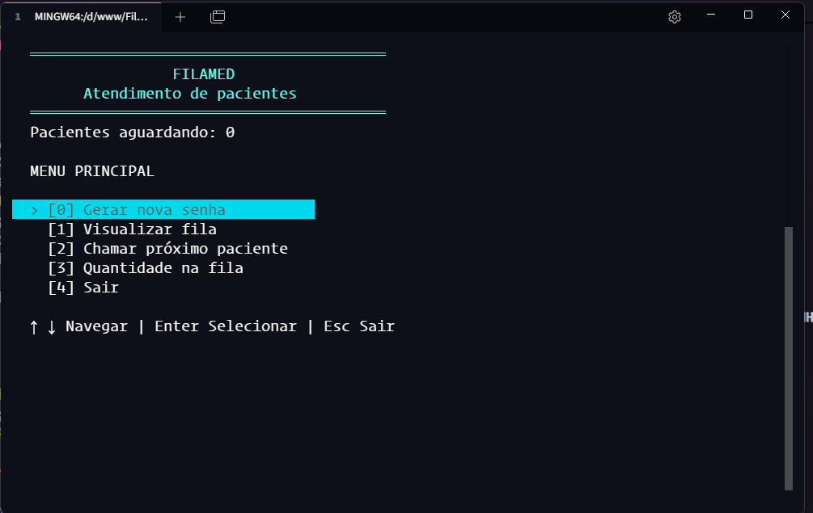
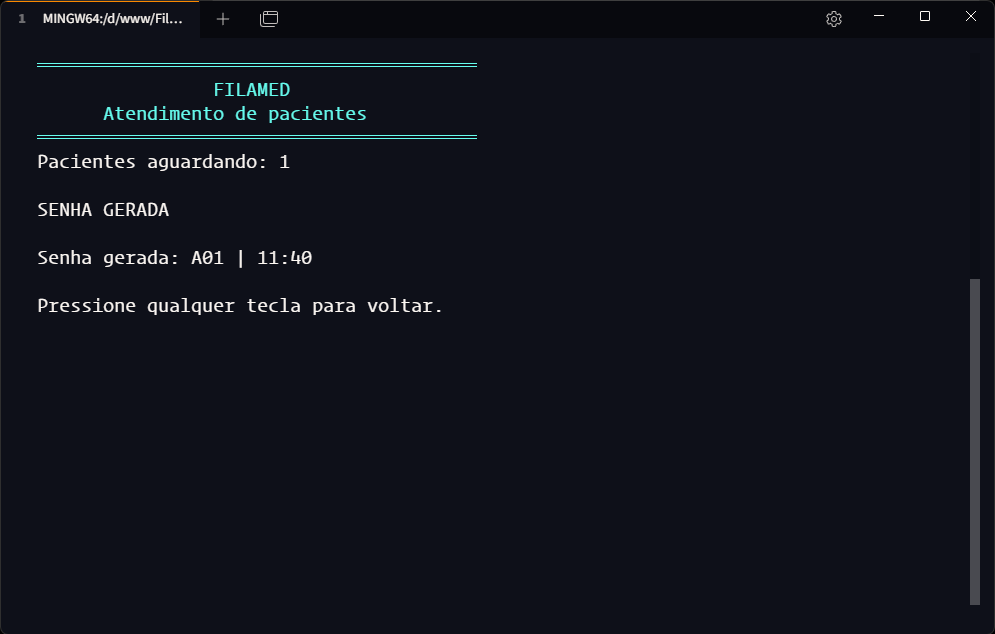
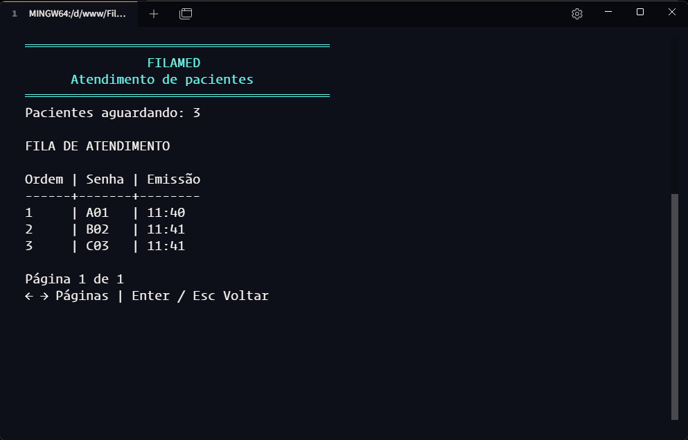
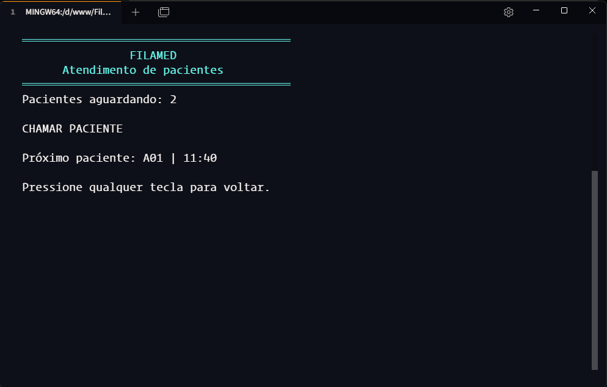

# 🏥 FilaMed

O **FilaMed** é um sistema simples de gerenciamento de fila de pacientes desenvolvido em **C# e .NET** para execução no terminal.

O projeto foi criado com o objetivo de praticar a estrutura de dados **FIFO (First In, First Out)** por meio de um cenário próximo do mundo real: uma fila de atendimento de pacientes.

## 🎯 Objetivo

O principal objetivo do projeto é compreender e aplicar a estrutura `Queue<T>` do .NET, entendendo na prática o funcionamento de uma fila baseada no princípio FIFO.

Em uma fila de atendimento, o primeiro paciente a gerar uma senha e entrar na fila deve ser o primeiro a ser chamado.

```text
A01 → B02 → C03 → A04
 ↑
 Primeiro a ser chamado
```

## ✨ Funcionalidades

- Gerar senhas sequenciais de atendimento
- Registrar data e horário de emissão da senha
- Adicionar pacientes à fila de espera
- Visualizar os pacientes que estão na fila
- Consultar a quantidade de pacientes aguardando
- Chamar o próximo paciente
- Remover da fila o paciente chamado seguindo a ordem FIFO
- Navegar pelo sistema através de um menu interativo no terminal

## 🖥️ Demonstração

Veja como o FilaMed organiza o atendimento no terminal: gere uma senha, acompanhe a fila e chame o próximo paciente seguindo a ordem FIFO.

### Menu principal

O menu reúne todas as funcionalidades. Use as teclas `↑` e `↓` para navegar, `Enter` para selecionar e `Esc` para sair.

<p align="center">
  <a href="docs/images/menu-principal.png.png">
    
  </a>
</p>

### Fluxo de atendimento

As telas abaixo mostram as principais operações. Clique em uma imagem para vê-la em tamanho completo.

<table>
  <tr>
    <td width="50%" valign="top">
      <h4>1. Gerar uma senha</h4>
      <p>A nova senha entra na fila com o horário de emissão registrado.</p>
      <a href="docs/images/senha-gerada.png.png">
        
      </a>
    </td>
    <td width="50%" valign="top">
      <h4>2. Visualizar a fila</h4>
      <p>Consulte as senhas na ordem de chegada dos pacientes.</p>
      <a href="docs/images/fila-atendimento.png.png">
        
      </a>
    </td>
  </tr>
  <tr>
    <td width="50%" valign="top">
      <h4>3. Chamar o próximo paciente</h4>
      <p>A primeira senha é chamada e removida da fila, seguindo o princípio FIFO.</p>
      <a href="docs/images/chamar-paciente.png.png">
        
      </a>
    </td>
    <td width="50%" valign="top">
      <h4>4. Consultar a quantidade</h4>
      <p>Confira quantos pacientes ainda aguardam atendimento.</p>
      <a href="docs/images/quantidade-fila.png.png">
        
      </a>
    </td>
  </tr>
</table>

## 🧠 Conceitos praticados

Durante o desenvolvimento do projeto são trabalhados conceitos como:

- FIFO (First In, First Out)
- `Queue<T>`
- Classes e objetos
- Encapsulamento
- Métodos
- Membros estáticos
- Generics
- `DateTime`
- Switch Expressions
- Formatação de strings e números
- Separação de responsabilidades
- Refatoração de código

## 🏗️ Estrutura do projeto

```text
FilaMed/
│
├── Model/
│   └── HospitalTicket.cs
│
├── Service/
│   ├── TicketService.cs
│   └── QueueService.cs
│
├── Ui/
│   └── Menu.cs
│
└── Program.cs
```

### HospitalTicket

Representa uma senha de atendimento, armazenando seu identificador e a data/hora em que foi emitida.

### TicketService

Responsável pela geração sequencial das senhas de atendimento.

Exemplo:

```text
A01
B02
C03
A04
B05
C06
```

### QueueService

Responsável pelo gerenciamento da fila de pacientes, incluindo a entrada de novas senhas, consulta da fila, quantidade de pacientes aguardando e chamada do próximo paciente.

### Menu

Responsável pela interface interativa no terminal, permitindo acessar as funcionalidades do sistema utilizando o teclado.

## 🔄 Funcionamento do FIFO

Suponha que os pacientes entrem na fila nesta ordem:

```text
A01 → B02 → C03
```

Ao chamar o próximo paciente, `A01` é removido:

```text
B02 → C03
```

Portanto:

```text
Primeiro a entrar → A01
Primeiro a sair   → A01
```

Esse comportamento representa o princípio:

**FIFO — First In, First Out.**

## 🛠️ Tecnologias

- C#
- .NET
- Console Application

## ▶️ Como executar

Clone o repositório:

```bash
git clone https://github.com/diegogrlima/FilaMed.git
```

Entre no diretório do projeto:

```bash
cd FilaMed
```

Execute a aplicação:

```bash
dotnet run
```

## 📚 Sobre o projeto

O FilaMed é um projeto de estudo desenvolvido para fortalecer fundamentos de programação por meio da aplicação de uma estrutura de dados em um cenário prático.

O projeto mantém o domínio propositalmente simples para que o foco permaneça no entendimento de **filas, FIFO, orientação a objetos, organização e refatoração de código**.